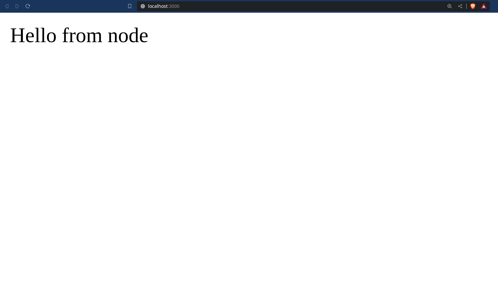

# Servidor NodeJS entregue através de um contêiner Docker

## Requisitos
|Tecnologia|Versão|
|------|-----|
|NodeJS|16^|
|Docker|
|Docker-Compose|

## Instruções
- Executar a criação dos serviços utilizando o docker-compose
```bash
docker-compose build
```

- Criar e iniciar os contêineres
```bash
docker-compose up
```

### Disclaimer:
  - O vínculo entre as portas do host:conteiner é definido na seção `ports` do arquivo `compose.yml`
  - A criação do volume /app dentro do contêiner possibilita a adição, remoção, alteração e compartilhamento de arquivos estáticos com o contêiner sem a necessidade de reiniciá-lo
&nbsp;


# Utilização
Acessando o endereço http://localhost:{porta-do-pc} você será recebido pela saudação do Node :grin:
- Tela Home (/)


- Tela Nome (/nome?nome=gabriel)

